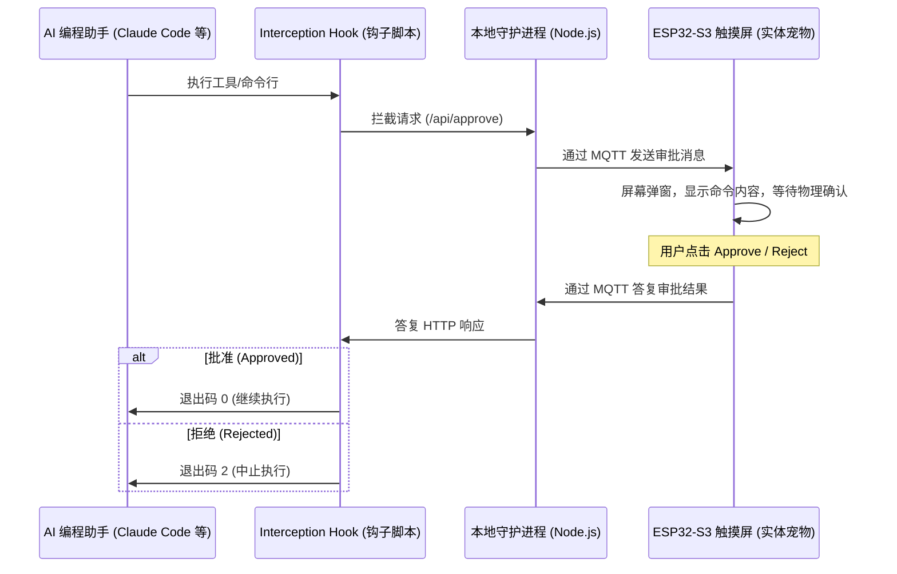

<p align="center">
  
</p>

# code-dog 🐶

<p align="center">
  <b>[English](README_EN.md) | 简体中文</b>
</p>

> **基于 ESP32-S3 触摸屏的多平台 AI 编程助手（Claude Code, Gemini, Antigravity, Codex, OpenCode）物理安全看门狗与电子宠物系统。支持从 Petdex 与 Codex-pets 平台一键导入宠物资产进行打包展示。**
> 
> *A physical security gateway & desktop mascot on ESP32-S3 for Claude Code, Gemini, Antigravity, Codex, and OpenCode. Supports direct importing and packaging of pet assets from Petdex & Codex-pets.*

---

## 🌟 核心功能

1. **物理安全审批网关（拦截审批模式）**
   - 实时拦截 AI 助手（如 Claude Code 等）调用的高危 Shell 命令或工具动作。
   - 挂起执行并将命令细节、工作目录及 AI 的思考过程推送到 ESP32-S3 触摸屏上。
   - 必须在屏幕上点击 **"Approve"** 允许执行，或点击 **"Reject"** 拒绝以安全终止 AI，有效防止 AI “删库跑路”或发生意外操作。

2. **动态电子宠物（伴侣模式）**
   - 在屏幕上渲染灵动的像素风小宠物，动作会随 AI 的运行状态动态改变：
     - **空闲 (Idle)**：AI 等待输入时，宠物眨眼或左右张望。
     - **审批/思考 (Review)**：AI 思考或读取分析文件。
     - **奔跑 (Run)**：AI 正在执行命令。
     - **跳跃 (Jump)**：批准的操作执行成功。
     - **失败 (Failed)**：AI 操作被拒绝或出错。

3. **动态 Client ID 机制（开箱即用）**
   - 守护进程在首次运行时自动生成唯一的 Client ID 并展示在网页控制台顶部。
   - 网页端直接修改 Client ID 会自动在后台重新订阅对应主题，防止公网 MQTT 代理上的多用户冲突。

4. **宠物商店与打包切片工具**
   - 支持通过页面链接（如 [Petdex 社区](https://petdex.crafter.run) 和 [Codex-pets 社区](https://codex-pets.net) 页面链接）一键直导导入宠物。
   - 后台将精灵表自动切片并压缩封装为 RGB565 大端格式的二进制资源包 (`pet_assets.bin`)，通过 Web 端拖拽面板轻松管理。

---

## 🛠️ 系统架构与工作流程



---

## 🚀 极速上手

### 📌 环境要求
- **系统环境**：Linux (如 Ubuntu/Debian)
- **运行环境**：Node.js (v18+)、Python 3.8+ (用于编译 ESP32 固件)
- **硬件设备**：带触摸屏的 ESP32-S3 开发板（默认支持 WaveShare 1.54寸 240x240 ST7789 触摸屏）

---

### 第一步：部署本地守护进程 (Local Daemon)

你可以选择**本地宿主机直接运行**或**使用 Docker Compose 部署**：

#### 选项 A：宿主机直接运行
1. 进入 `local-daemon` 目录并安装依赖包：
   ```bash
   cd local-daemon
   npm install
   ```
2. 启动守护进程：
   ```bash
   npm start
   ```

#### 选项 B：Docker Compose 容器化部署
如果你希望环境完全隔离，直接在项目根目录下执行：
```bash
docker-compose up -d
```

> 💡 **关键动作**：
> 运行成功后，在浏览器中打开 `http://localhost:4000`。记录并复制网页顶部 Header 区域自动生成的 **Client ID**。

---

### 第二步：编译与烧录 ESP32-S3 固件

为防止秘钥和配置泄漏，我们采用环境变量隔离设计。请按以下傻瓜级步骤操作：

#### 1. 赋予 Linux 串口读写权限
在 Linux 下，烧录需要读写 `/dev/ttyACM*` 设备，运行以下命令为当前用户授权：
```bash
sudo usermod -aG dialout $USER
# 提示：运行后需要重新登录或重启终端生效。
# 如果想临时快速授权，也可以直接运行：
sudo chmod 666 /dev/ttyACM*
```

#### 2. 初始化 Python 虚拟环境 (`.venv`)
项目使用 PlatformIO Core CLI 编译固件。如果您尚未配置 Python 虚拟环境，请在项目根目录下运行以下命令创建并安装依赖：
```bash
# 1. 创建虚拟环境
python3 -m venv .venv

# 2. 激活虚拟环境
source .venv/bin/activate

# 3. 安装 PlatformIO 核心依赖包
pip install -U platformio
```

#### 3. 配置配置文件 `.env`
在项目根目录下，将 `.env.example` 复制为 `.env`：
```bash
cp .env.example .env
```
用编辑器打开 `.env`，填入你的 WiFi 账号、密码以及在网页端复制的 **Client ID**：
```ini
WIFI_SSID="您的WiFi名称"
WIFI_PASS="您的WiFi密码"
CLIENT_ID="网页端复制的Client ID"
```

#### 4. 一键编译与烧录
将开发板通过 USB 线连接电脑。确保开发板处于下载模式（按住 BOOT 键，按一下 RESET 键，松开 BOOT 键），在虚拟环境下执行烧录：
```bash
# 如果尚未激活虚拟环境，先激活：source .venv/bin/activate
pio run -t upload
```
*提示：PlatformIO 在编译时会自动调用 `read_env.py` 脚本，将 `.env` 中的变量编译为 C++ 宏注入固件，无需手动修改 `src/main.cpp`。*

---

### 第三步：激活 AI 助手命令拦截

打开网页控制台 `http://localhost:4000` 的 **Hook 控制面板** (Hook Control Panel) 标签页：
- 将你想监控的 AI 助手（如 Claude Code、Antigravity 终端等）切换为 **`strict`** (物理审批模式) 或 **`companion`** (仅显示宠物动画状态)。

现在，当 AI 助手在终端中尝试运行命令时，它会挂起并显示等待，直到你在桌面的 ESP32 屏幕上按下 **"Approve"**。

---

## ⚠️ 常见问题与“紧急救援” FAQ

### Q1: 后端服务器关闭了，我的终端卡死完全动不了，怎么“自救”？
**原因**：当处于 `strict` 拦截模式时，钩子脚本会一直尝试请求本地后端的 `/api/approve`。如果后端挂掉，请求会阻塞，导致任何 Bash 命令（如 `ls`, `cd`）都无法执行。
**解法**：在终端里直接复制并执行以下紧急命令，即可立刻关闭钩子拦截：
```bash
curl -X POST http://localhost:4000/api/hooks/toggle -H "Content-Type: application/json" -d '{"platform":"claude-code","enabled":false}'
```
*提示：如果是 Antigravity 助手，其专用 bash 包装器自带安全白名单（`ls`, `ps` 等核心命令默认放行，不会锁死）。*

### Q2: PlatformIO 烧录时提示 `Permission denied` 或找不到设备？
- 确认开发板的数据线是否正确连接（不要接在 Power 纯供电口，要接在 USB/UART 通信口）。
- 再次执行临时授权命令：`sudo chmod 666 /dev/ttyACM*`（针对 USB-CDC 串口）。

### Q3: 屏幕上显示 `OFFLINE`，或者宠物猫咪一直加载不出来？
- **WiFi 连通性**：检查 `.env` 中的 WiFi 账号密码是否正确，且开发板天线信号正常。
- **MQTT Broker 连通性**：本地守护进程和 ESP32 默认连接公网 EMQX Broker (`broker-cn.emqx.io:1883`)。请确保开发板和电脑能够正常访问互联网。如果你的局域网环境有限制，可以在 `server.js` 和 `src/main.cpp` 中换成私有或本地 MQTT 代理。
- **重新订阅**：在 Web UI 顶部重新点击 `Update Client ID` 或者重置一次 Client ID，并重启开发板即可触发强制同步。
