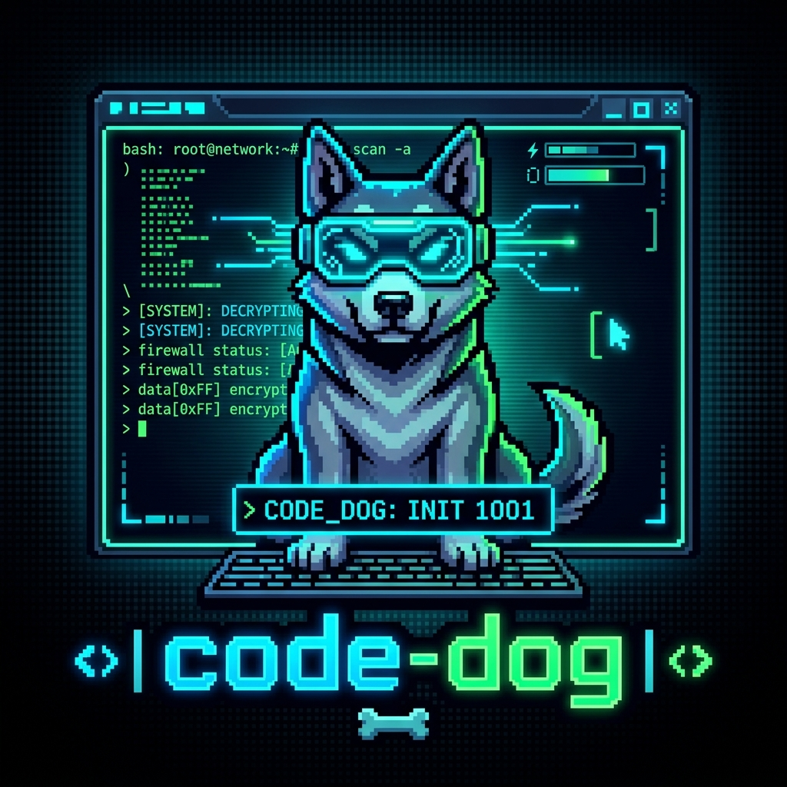
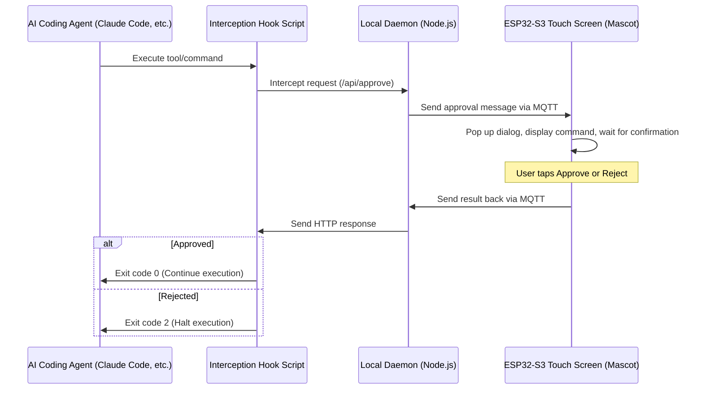

<p align="center">
  
</p>

# code-dog 🐶

<p align="center">
  <b>English | [简体中文](README.md)</b>
</p>

> **A physical security gateway & desktop mascot on ESP32-S3 for Claude Code, Gemini, Antigravity, Codex, and OpenCode. Supports direct importing and packaging of pet assets from Petdex & Codex-pets.**
> 
> *基于 ESP32-S3 触摸屏的多平台 AI 编程助手（Claude Code, Gemini, Antigravity, Codex, OpenCode）物理安全看门狗与电子宠物系统。支持从 Petdex 与 Codex-pets 平台一键导入宠物资产进行打包展示。*

---

## 🌟 Key Features

1. **Physical Approval Gateway (Strict Guard Mode)**
   - Intercepts potentially risky shell commands or tool executions initiated by AI agents in real-time.
   - Pushes command details, workspace paths, and AI thinking context to a physical ESP32-S3 touch screen.
   - Requires physical confirmation (click **"Approve"**) to proceed, or click **"Reject"** to halt and safely terminate agent execution.

2. **Animated Desktop Mascot (Companion Mode)**
   - Renders animated 2D pixel-art pets that dynamically react to AI agent activity states:
     - **Idle**: Looking around or blinking when AI is waiting for prompts.
     - **Review (Thinking)**: Pondering/inspecting files.
     - **Run**: Running commands.
     - **Jump (Success)**: Celebrating approved/successful actions.
     - **Failed**: Crying or showing disappointment on rejection or command errors.

3. **Dynamic Client ID Configuration**
   - Automatically generates a unique Client ID on first run, displayed in the web dashboard header.
   - Modifying the Client ID in the Web UI dynamically re-subscribes MQTT channels to prevent network conflicts.

4. **Pet Store & Asset Packaging Tool**
   - Import mascot spritesheets directly from links of community galleries like [Petdex](https://petdex.crafter.run) and [Codex-pets](https://codex-pets.net).
   - Automatically slices and packages spritesheet assets into high-performance big-endian RGB565 binary payloads (`pet_assets.bin`) to flash onto the ESP32.

---

## 🛠️ Architecture & Workflow



---

## 🚀 Getting Started

### 📌 Prerequisites
- **Operating System**: Linux (e.g. Ubuntu/Debian)
- **Environments**: Node.js (v18+), Python 3.8+ (for ESP32 firmware compilation)
- **Hardware**: ESP32-S3 board with a Touch LCD screen (default settings optimized for WaveShare 1.54" 240x240 ST7789 display)

---

### Step 1: Run the Local Daemon

You can choose to **run directly on your host machine** or **use Docker Compose**:

#### Option A: Direct Host Execution
1. Navigate to the `local-daemon` folder and install dependencies:
   ```bash
   cd local-daemon
   npm install
   ```
2. Start the daemon:
   ```bash
   npm start
   ```

#### Option B: Docker Compose Deployment
To keep your host environment clean, run this command in the project root:
```bash
docker-compose up -d
```

> 💡 **Critical Step**:
> Once the daemon is running, open `http://localhost:4000` in your browser. Copy the auto-generated **Client ID** from the header.

---

### Step 2: Compile & Flash the ESP32-S3 Firmware

To prevent credentials leakage, we use environment variables for compilation. Follow these simple steps:

#### 1. Grant Serial Port Permissions (Linux)
To flash code to `/dev/ttyACM*` devices, grant permissions to the current user:
```bash
sudo usermod -aG dialout $USER
# Note: You may need to re-login or restart the terminal session for this to take effect.
# For temporary quick access, you can also run:
sudo chmod 666 /dev/ttyACM*
```

#### 2. Initialize Python Virtual Environment (`.venv`)
The project compiles code using PlatformIO Core CLI. If you do not have a virtual environment set up, run the following commands in the project root:
```bash
# 1. Create a virtual environment
python3 -m venv .venv

# 2. Activate the virtual environment
source .venv/bin/activate

# 3. Install PlatformIO Core dependencies
pip install -U platformio
```

#### 3. Configure the `.env` File
In the project root, copy `.env.example` to `.env`:
```bash
cp .env.example .env
```
Open `.env` in a text editor and fill in your WiFi credentials and your **Client ID**:
```ini
WIFI_SSID="your_wifi_name"
WIFI_PASS="your_wifi_password"
CLIENT_ID="copied_client_id_from_web_ui"
```

#### 4. Build and Flash
Connect your board via USB. Hold the BOOT button, press the RESET button, and release the BOOT button to enter download mode. In the activated virtual environment, run:
```bash
# Activate virtual environment if not already: source .venv/bin/activate
pio run -t upload
```
*Note: PlatformIO automatically invokes the `read_env.py` pre-build script to compile the `.env` variables into C++ preprocessor macros. There is no need to manually modify `src/main.cpp`.*

---

### Step 3: Activate Platform Interception

Go to the **Hook Control Panel** tab on the Web Dashboard (`http://localhost:4000`):
- Toggle your target AI agents (e.g. Claude Code, Antigravity) to **`strict`** (Interception Approval) or **`companion`** (Mascot Only).

Now, when your AI agent attempts to run a shell command, it will hang and wait until you physically click **"Approve"** on the screen.

---

## ⚠️ Troubleshooting FAQ

### Q1: The backend is shut down, and my terminal is locked! How do I recover?
**Reason**: In `strict` mode, the hook script blocks until it receives a response from `/api/approve` on the local daemon. If the backend is down, the request blocks and locks your terminal command-line.
**Fix**: Copy and run this command in your terminal to instantly disable the interception hook:
```bash
curl -X POST http://localhost:4000/api/hooks/toggle -H "Content-Type: application/json" -d '{"platform":"claude-code","enabled":false}'
```
*Note: Antigravity terminal wrappers have a built-in safety whitelist (`ls`, `ps` are allowed by default) to prevent total deadlock.*

### Q2: PlatformIO flashing fails with `Permission denied`?
- Verify your board is connected via the USB-CDC/UART data port (not the power-only port).
- Re-run the temporary authorization command: `sudo chmod 666 /dev/ttyACM*`.

### Q3: Screen displays `OFFLINE` or pet assets fail to sync?
- **WiFi Connection**: Verify your WiFi credentials in `.env` are correct, and your board has good signal coverage.
- **MQTT Connection**: The daemon and board default to EMQX Broker (`broker-cn.emqx.io:1883`). Ensure both your computer and board can connect to the internet. If you are in a firewalled environment, update the MQTT host in `server.js` and `src/main.cpp` to use a local broker.
- **Force Sync**: Click `Update Client ID` in the Web UI to trigger a fresh MQTT state publication, then reset your development board.
