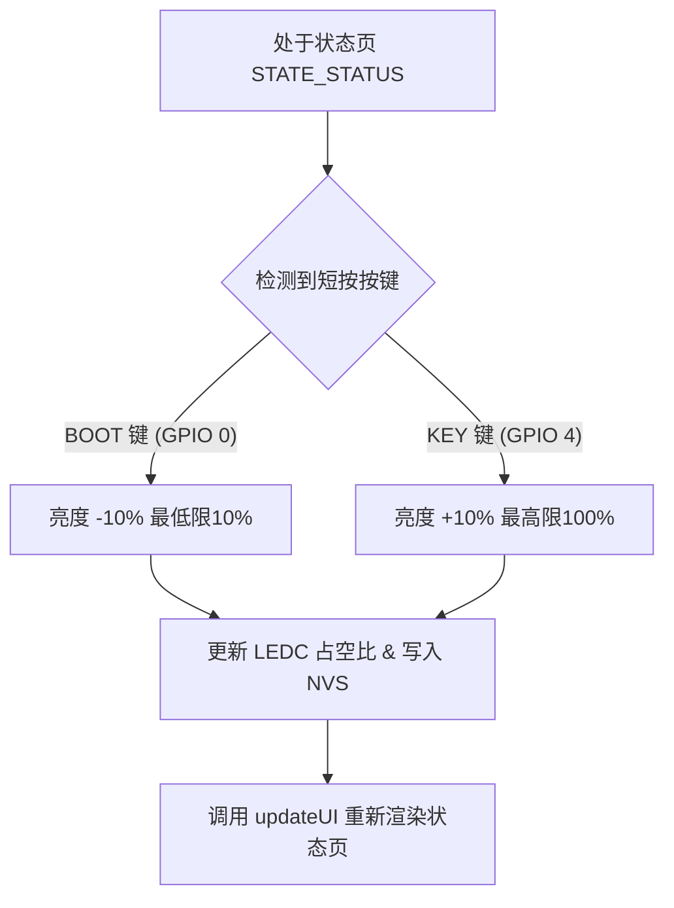

# 硬件端亮度调整功能设计文档 (Design Spec)

## 1. 目标描述
在当前系统（基于 ESP32-S3 电子宠物和安全网关）的“状态页” (Diagnostics Mode) 中，允许用户使用物理按键控制屏幕背光亮度，并且在设备重启后能保持亮度设置。

- **减少亮度**：在状态页短按 BOOT 键（GPIO 0，即左键）。
- **增加亮度**：在状态页短按 KEY 键（GPIO 4 / PIN_PLUS，即右键）。
- **按键反馈**：每次按键调整亮度时，屏幕亮度实时变化，且状态页中显示的亮度进度条和百分比文本同步更新。
- **持久化**：用户调整的亮度值将实时写入 ESP32 的 NVS Flash，在设备重启或关机后重新开机时恢复此亮度。

## 2. 详细设计

### 2.1 PWM 背光调节 (LEDC)
使用 ESP32 的 LEDC（LED 脉宽调制控制器）控制屏幕背光引脚 `GFX_BL` (GPIO 46) 的高低电平占空比。
- **配置参数**：
  - LEDC 通道：`0`
  - 频率：`5000 Hz`
  - 分辨率：`8位`（即范围 0 - 255）
- **亮度映射**：
  - 系统定义的亮度值为 10% 至 100%（以 10% 为步长，共 10 档）。
  - 为防止亮度设为 0% 时屏幕完全漆黑使用户无法恢复设置，我们将 10% - 100% 亮度映射至 `15 - 255` 的 PWM 占空比。

### 2.2 亮度数据持久化 (Preferences)
使用 Arduino ESP32 开发框架下的 `<Preferences.h>` 库将配置数据以键值对形式存入 ESP32 的非易失性存储中：
- 命名空间：`"system"`
- 键名：`"brightness"`
- 默认值：`80` (即 80%)

### 2.3 按键交互重写
当 `currentState` 为 `STATE_STATUS`（状态页）时，在物理按键轮询函数 `checkButtons()` 中拦截 BOOT 键和 PLUS/KEY 键的短按动作，不让其执行其他跳转动作，而只用于调节背光亮度。

#### 交互路径：


### 2.4 UI 界面展示
在 `drawStatusScreen()` 中的“TETHERED MODE”面板卡片内部空白区域（靠近底部，y = 180 ~ 200）绘制：
1. **亮度百分比文本**：例如 `亮度: 80%`。
2. **渐变进度条**：使用 `fillRoundRect` 填充背景，并用天蓝色填充当前亮度的长度。
3. **实体按键提示**：在最右侧印出 `[-/+]`。

## 3. 核心修改点 (主要文件: src/main.cpp)

### 3.1 变量与库引用
```cpp
#include <Preferences.h>

extern int screenBrightness;
extern Preferences prefs;
```

### 3.2 控制逻辑实现
1. 封装 `void setBrightness(int percent)` 和 `void initBrightness()` 函数。
2. 封装 `void saveBrightness(int percent)` 函数。
3. 在 `setup()` 中调用 `initBrightness()` 代替原有的引脚初始化代码。
4. 在 `checkButtons()` 中，当 `currentState == STATE_STATUS` 时增加对 `PIN_BOOT` 和 `PIN_PLUS` 短按的处理。
5. 在关机逻辑中（`checkButtons()` 的 PWR 长按分支），拉低引脚前通过 `ledcWrite(0, 0)` 切断 PWM 信号输出。
6. 修改 `drawStatusScreen()` 以绘制亮度 UI 条。

## 4. 验证计划
1. **编译测试**：使用 `.venv/bin/pio run` 验证代码无语法及库冲突问题。
2. **功能验证**：
   - 烧录并重启后，验证屏幕是否处于默认亮度。
   - 长按屏幕 3 秒或短按 PWR 键进入状态页，观察是否出现亮度指示条。
   - 连续短按 BOOT 键（左键），观察背光是否变暗、屏幕 UI 亮度百分比及进度条是否随之缩短（到 10% 后不再继续降低）。
   - 连续短按 KEY 键（右键），观察背光是否变亮、屏幕 UI 亮度进度条是否加长（到 100% 后不再继续增加）。
   - 调至指定亮度（如 40%），短按 PWR 键关机或直接断电拔掉数据线。重新插电开机，观察开机后的初始亮度是否为 40%。
